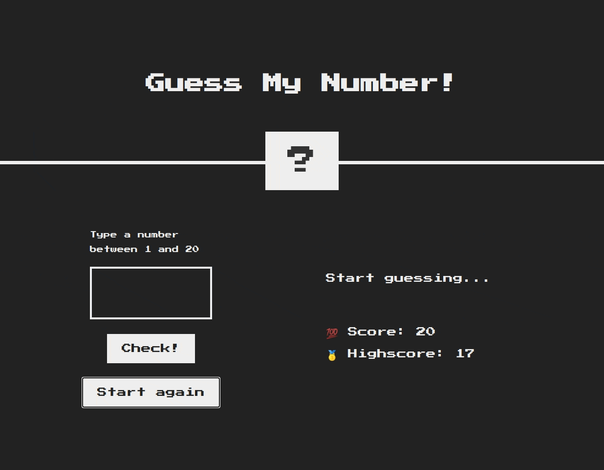

# Guess my number!

Try to guess the secret number, and get a hint if your guess is too high or too low. Try to find the correct number in as few guesses as possible and beat your previous highscore.

This is an implementation of the classic 'Guess my Number' game in HTML, CSS and JavaScript, built as a means to learn and practice Document Object Model (DOM) manipulation.

Original design by [Jonas Schmedtmann](https://github.com/jonasschmedtmann). I added the ability to make a guess by pressing the Enter key, and applied some minor interface changes.

## Demo

[Click here to give it a try](https://msgaspar.gihub.io/guess-my-number-game)

